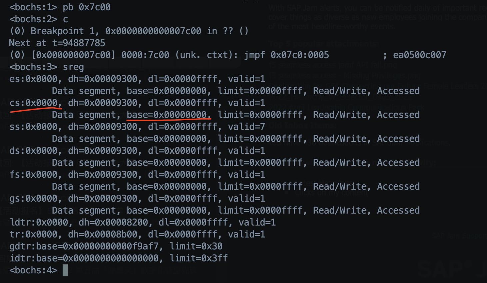

[toc]

本章的主要目的包括：

    1. 学会GNU AS 汇编语法
    2. 了解16bits和32bits汇编的不同
    3. ld script的基本用法
    4. 汇编和C的混合Build方法

# GNU AS汇编
- 主要不同是操作数顺序
- 所有的寄存器都要加上 %
- 寻址不同，利用 `()` 而不是`[]`
- 详情参考手册`info gas`

# 16bits汇编 32bits汇编
> 使用GNU AS编译汇编源码，如果想编译成16bits在实地址模式下运行，需要使用一个伪操作符号`.code16` or `.code16gcc`。

> 在此中方式中，如果你操作的是32bits操作数，那么生成的机器码前面会有一个 `machine code prefix:0x66`; 如果操作的是32位地址的话，机器码前缀是`0x67`。

# ld script
基本用法：

    ENTRY(_start)
    SECTIONS
    {
        . = 0x00; /* 为啥？ 请参考执行到boot时的各个寄存器值 */
        .text : 
        {
            *(.text)
        }
        .data :
        {
            *(.data)
        }
    }

此时，EIP = 0x7c00

# 编译16bits程序 FLAGS和查看命令

    ASFLAGS=--32
    LDFLAGS=-m elf_i386
    CLFAGS=-m32
    
    asm代码: .code16gcc

    objdump -m i8086 -S xxx.obj

# 第一个简单DEMO（利用了GNU AS语法）
- 参考代码 boot.s
- 只有汇编代码，而且使用的是GNU AS语法
- 功能和 Chap02_Building的 DEMO 效果一样
- 比较两者，可以加深代码理解。很简单！ 加油！！！

# 第二个DEMO 加入了main.c

