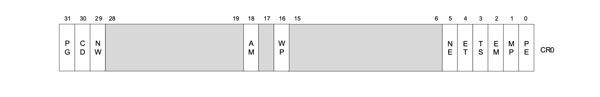
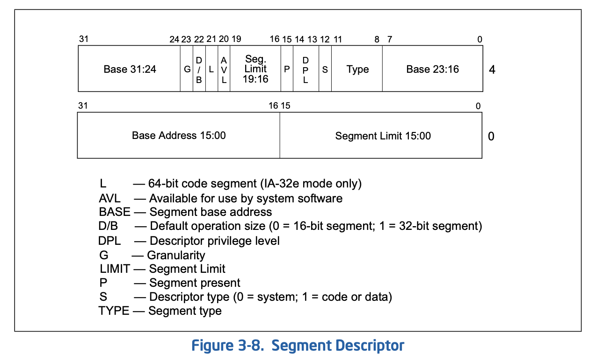
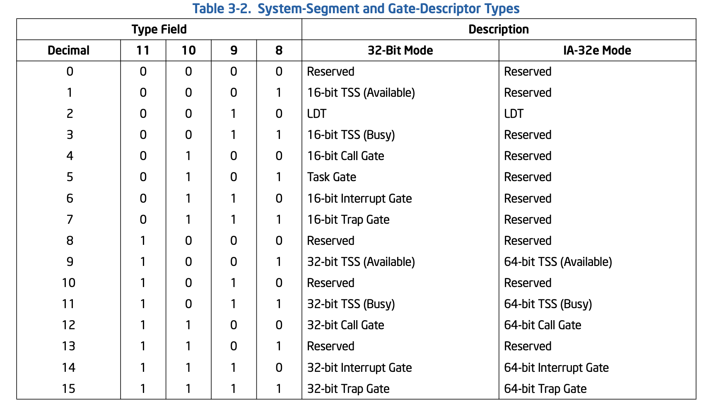
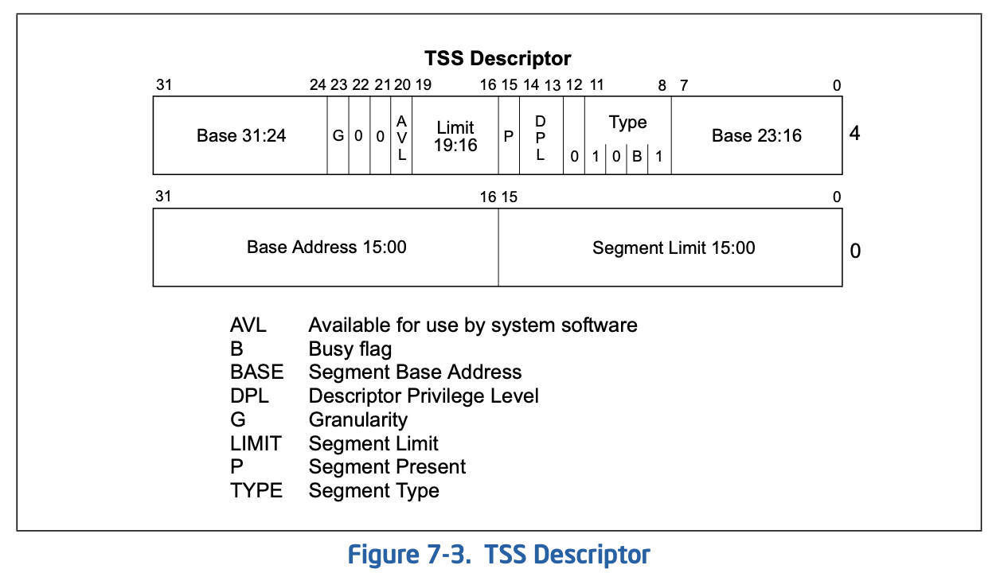
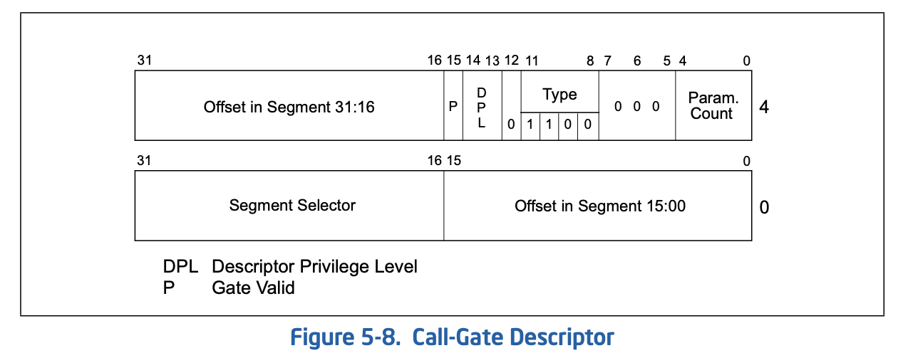
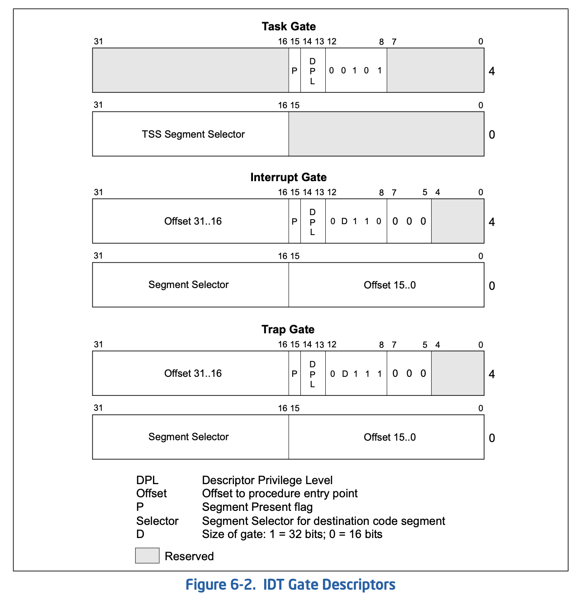

[toc]

本章学习的主要目标：

    1. 什么是保护模式？
    2. 如何开启保护模式？ CR0
    3. 什么是段 segment？
    4. 段格式: 代码段，数据段，系统段
    5. 段限长检查
    6. 段优先级检查
    7. 段选择符
    8. GDT LDT IDT

本章内容比较多，主要就是INTEL CPU方面的知识，还是比较重要的。大家可以多花点精力，不清楚的地方可能还需要你网上多多查找有关资料，或者写代码在虚拟机BOCHS或者QEMU上验证下。


# 保护模式 vs 实地址模式

保护模式有更好的隔离：
- 用户空间和内核空间不相互影响； 
- 两个应用程序之间不相互影响；

|Item|Real Mode|Protected Mode|
|---|---|---|
|地址计算方式|(CS<<4)+IP|CS(selector) -> DT -> Base + IP|
|段LIMIT|64K|基于段描述符里的LIMIT字段和G字段|
|权限||优先级检查|


# 保护模式开启之路

    开启保护模式很简单，主要就是利用控制寄存器 CR0.PE[bit0]. 格式如下：



实现方法1：

        movl %CR0, %eax
        orl $0x0001, %eax
        movl %eax, %CR0
    
实现方法2:

        smsw %ax
        orw $0x0001, %ax
        lmsw %ax


# 段格式












# 段限长检查
- 可以清晰的看出 段描述符中段限长Field总共20bits。
- 那段限长还和什么有关呢？答案很简单，和G位有关。
  > G = 1; 段限长单位是4K，也就是一页。
  > G = 0; 段限长单位是1Byte。
- `Effective limit = G?[LIMIT FIELD]*4K:[LIMIT_FIELD]`
- 段限长的意义呢？
  > 这个好玩？要分两种情况分析！
  >> 1. 向下扩展数据段( TYPE : 01xx ): [effective limit+1,UpperBound] 能访问。
  >> 2. Other segments : [0,effective limit]能访问。
- 当G=1时；地址的低12位不检查。例如, if the segment limit is 0, offsets 0 through FFFH are still valid.

- 顺便一提，何为UpperBound？怎么决定他的数值呢？
  ```
  if( B == 1)
      UpperBound = 0xFFFFFFFF;
    else
      UpperBound = 0xFFFF;
  ```


- 怎么用汇编提取limit数值？
  ```
  movl $DATA_SEG, %eax
  lsl %eax, %ebx
  ```
  > the result is LIMIT field in SEGMENT DESCRIPTOR when G = 0;
  > othersize, it's (LIMIT << 12) + 0xFFF when G = 1.
  > It's same as the limit value shown in Bochs when executing 'sreg' or 'info gdt'

- If the limit is set to 0 and G=0, the access to memory location `[BYTE0]` is ok, but failded when accessing memeory location `[BYTE1]`


- If the limit is set to 0 and G=0 and Expand-down, the access to memory location `[BYTE0]` fails, however the access to memory location greater `[BYTE0]` is OK.

- Note that when scaling is used (G flag is set), the lower 12 bits of a segment offset (address) are not checked against the limit; for example, note that if the segment limit is 0, offsets 0 through FFFH are still valid.

# 段优先级检查


# 段选择符 SELECTOR
- 代码实现中通过段寄存器(CS,DS,ES,FS,GS,SS)来选择段的
- 而段是通过段选择符来选中的
- 所以CS,DS中显式部分村的是SELECTOR，而隐式部分才存的是描述符。


如何加载段选择符？

        1. mov %ax, %ds

        2. lds m16:32, r32

        3. ljmp $SEL, $IP

加载%SS:%ESP的代码示例：
  ```
  STACK_SEG = 0x20
  lss __stack, %esp

  .space 128
  __stack:
    .long __stack
    .word STACK_SEG
  ```

Note:
* [x] 不能mov到CS


# GDT LDT IDT


# 设置GDT
```
lgdt __gdt_48

__gdt_48:
## LIMIT is the total len minus 1 
.word 5*8-1
## THIS is VERY IMPORTANT that we have to specify the 'absolute physical address' for GDT
.long __gdt + (BOOT_SEG<<4)
```
> 特别提醒的是GDT的地址一定要是绝对的物理地址，而不是段偏移值！！！


# Note
- **Segment** is totally different from the **Section** used in object file.


# 一个小小DEMO - Lesson01
- 因为不想牵涉到磁盘数据读写，所以尽量会把代码集中在一个扇区大小(0x200)。这样 BIOS直接就会把代码Download到0x7c00处执行了。一个字，省事儿！！！ 嗯？几个字？
    
- 主要使用GNU AS来实现。

- 请多多注意：当切换到protected mode时，我们用的是`ljmp $CODE_SEL,$IP`; 然后如果这个代码段是32位的话(D Flag),我们需要切换代码`.code32`到32位。如果D=0的话，就没必要切换了。

- 包括内容：
  1. 如何家在GDT进入GDTR中
  2. 如何获取Segment Limit
  3. 段现场检查 - 什么时候violation？
  4. 段中D/B的含义 
  5. 段中G的含义


# 又一个小小DEMO - Lesson02
- 

# 一个改进的小小DEMO - Lesson03
- 利用c来实现 字符串的显示

