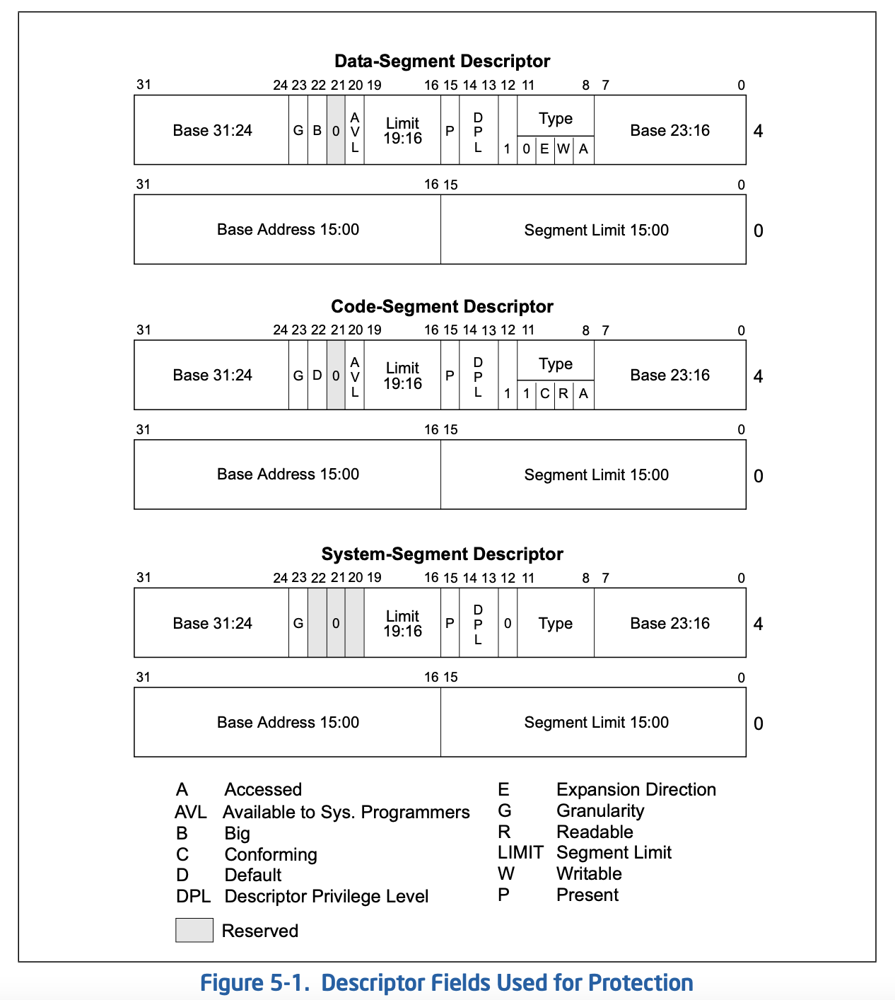
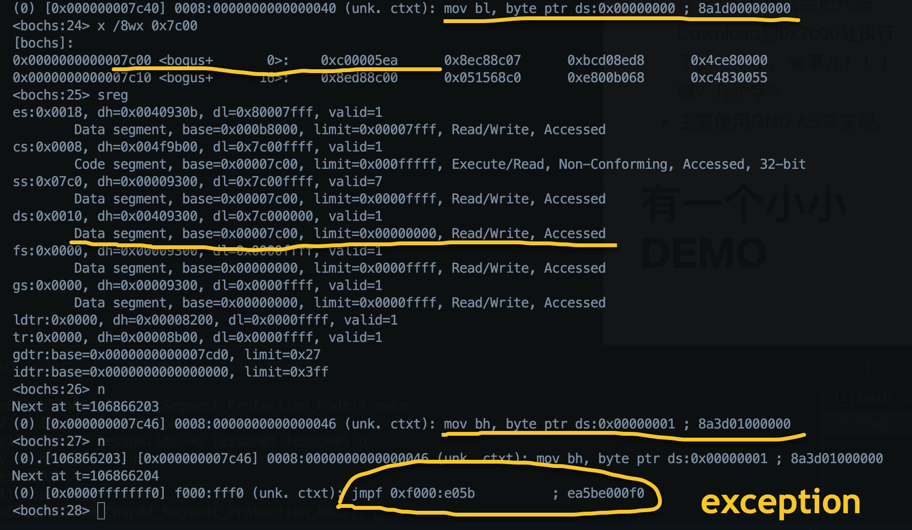
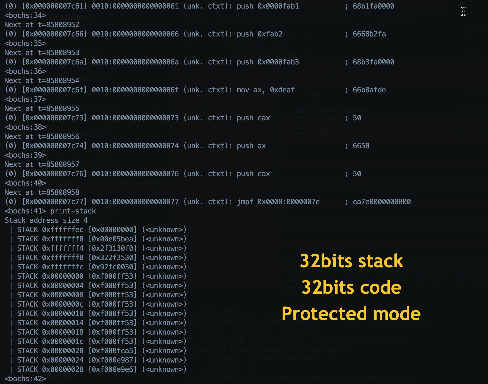

[toc]

本章学习的主要目标：

    1. 什么是保护模式？
    2. 如何开启保护模式？ CR0
    3. 什么是段 segment？
    4. 段格式: 代码段，数据段，系统段
    5. 段限长检查
    6. 段优先级检查
    7. 段选择符
    8. GDT LDT IDT
    9. A20

本章内容比较多，主要就是INTEL CPU方面的知识，还是比较重要的。大家可以多花点精力，不清楚的地方可能还需要你网上多多查找有关资料，或者写代码在虚拟机BOCHS或者QEMU上验证下。


# 保护模式 vs 实地址模式

保护模式有更好的隔离：
- 用户空间和内核空间不相互影响； 
- 两个应用程序之间不相互影响；

|Item|Real Mode|Protected Mode|
|---|---|---|
|地址计算方式|(CS<<4)+IP|CS(selector) -> DT -> Base + IP|
|段LIMIT|64K|基于段描述符里的LIMIT字段和G字段|
|权限||优先级检查|

# A20
计算机启动时，默认是开启A20的。

两种方式可以开启A20，一种是通过键盘控制端口0x60；另外一种是快速A20寄存器，端口是0x92。

- Write '1' to 键盘控制器端口0x60
  *TBD*

- Wirte '1' to 快速A20寄存器0x92
  |Bit1|Bit0|
  |---|---|
  |1:计算机重启|1:开启A20|

  ```
  in $0x92, %al
  orb $0x02, %al
  outb %al, $0x92
  ```


# 保护模式开启之路

    开启保护模式很简单，主要就是利用控制寄存器 CR0.PE[bit0]. 格式如下：


实现方法1：

        movl %CR0, %eax
        orl $0x0001, %eax
        movl %eax, %CR0
    
实现方法2:

        smsw %ax
        orw $0x0001, %ax
        lmsw %ax


# 段格式


> Bit11 in **Type Field** 被认为是Execute位。




# 段限长检查
- 可以清晰的看出 段描述符中段限长Field总共20bits。
- 那段限长还和什么有关呢？答案很简单，和G位有关。
  > G = 1; 段限长单位是4K，也就是一页。
  > G = 0; 段限长单位是1Byte。
- `Effective limit = G?[LIMIT FIELD]*4K:[LIMIT_FIELD]`
- 段限长的意义呢？
  > 这个好玩？要分两种情况分析！
  >> 1. 向下扩展数据段( TYPE : 01xx ): [effective limit+1,UpperBound] 能访问。
  >> 2. Other segments : [0,effective limit]能访问。
- 当G=1时；地址的低12位不检查。例如, if the segment limit is 0, offsets 0 through FFFH are still valid.

- 顺便一提，何为UpperBound？怎么决定他的数值呢？
  ```
  if( B == 1)
      UpperBound = 0xFFFFFFFF;
    else
      UpperBound = 0xFFFF;
  ```


- 怎么用汇编提取limit数值？
  ```
  movl $DATA_SEG, %eax
  lsl %eax, %ebx
  ```
  > the result is LIMIT field in SEGMENT DESCRIPTOR when G = 0;
  > othersize, it's (LIMIT << 12) + 0xFFF when G = 1.
  > It's same as the limit value shown in Bochs when executing 'sreg' or 'info gdt'

- If the limit is set to 0 and G=0, the access to memory location `[BYTE0]` is ok, but failded when accessing memeory location `[BYTE1]`


- If the limit is set to 0 and G=0 and Expand-down, the access to memory location `[BYTE0]` fails, however the access to memory location greater than `[BYTE0]` is OK.

- Note that when scaling is used (G flag is set), the lower 12 bits of a segment offset (address) are not checked against the limit; for example, note that if the segment limit is 0, offsets 0 through FFFH are still valid.

# 段优先级检查


## Current Privilege Level (CPL)
存放在CS和SS<u>**段寄存器**</u>的Bit1,Bit0中。

## Requested Privilege Level (RPL)
存放在选择符的Bit1,Bit0中。

## Data Segment Privilege Level Checking

在把一个段选择子加载进段寄存器之前，处理器会进行特权级检查
在数值上必须满足以下两点：
1. CPL<=数据段描述符的DPL
2. RPL<=数据段描述符的DPL
否则，会产生一个一般保护异常。

## Stack Segment Privilege Level Checking
处理器要求，在任何时候，栈段的特权级必须和CPL相同。因此，随着程序的执行，要对段寄存器SS的内容进行修改时，必须进行特权级检查。在数值上必须满足以下两点：
1. CPL==堆栈段描述符的DPL
2. RPL==堆栈段描述符的DPL
否则也会产生一般保护异常。

## Code Segment Privilege Level Checking

所有的程序转跳，CPU都不会把段选择子的RPL赋给转跳后程序的CS.RPL.转跳后程序的CPL(CS.RPL)只会有下面的两种可能

**转跳后程序的CPL(CS.RPL) = 转跳前程序的CPL(CS.RPL)**
　　或
**转跳后程序的CPL(CS.RPL) =　转跳后程序的CodeSegmentDescriptor.DPL**


### 普通跳转(jmp/call/ret -> 代码段)

1. 一致性代码段
   * Conditions
      * [x] CPL >= DPL
      * [ ] RPL  
   * Results
      * [x] CPL保持不变
      * [x] Stack不发生切换 

2. 非一致性代码段 
   * Conditions
      * [x] CPL == DPL
      * [x] RPL <= CPL
   * Results
      * [x] CPL保持不变
      * [x] Stack也不会发生切换

### 调用门跳转  
#### JMP
   * Conditions
      * [x] CPL <= CG.DPL
      * [x] RPL <= CG.DPL
      * 一致性代码段
         * [x] CPL >= DPL
      * 非一致性代码段
         * [x] CPL == DPL
   * Results
      * [x] CPL保持不变
      * [x] Stack也不发生切换
      
#### CALL
   * Conditions
      * [x] CPL <= CG.DPL
      * [x] RPL <= CG.DPL
      * 一致性代码段
         * [x] CPL >= DPL
      * 非一致性代码段
         * [x] CPL >= DPL
   * Results
      * 一致性代码 
        * [x] CPL保持不变
        * [x] Stack也不发生切换
      * 非一致性代码
        * [x] CPL可能发生变化（if CPL>DPL）
        * [x] Stack也可能发生切换


## 访问代码段中的数据
* 非一致代码段(和访问数据段一样）
   * [x] CPL <= CodeSeg.DPL
   * [x] RPL <= CodeSeg.DPL
* 一致代码段
   * [x] 总是成功 -- 用户态可以访问内核态一致性代码段内容
* 通过代码段覆盖前缀(CS)
   * [x] 总是成功

## 中断门 / 陷阱门
### Conditions
* [x] Gate DPL >= CPL; if software interrupt( Generated by INT n, INT3 or INTO)
* [x] CPL >= Code Segment DPL

### Results
* [x] TF = 0; NT = 0;
* [x] IF = 0; if it&apos;s Interrupt Gate.
* [x] 非一致代码段
    * CPL > CS DPL //优先级切换，栈也会切换
    * CPL = CS DPL //优先级不切换，栈也不切换
* [x] 一致代码段
    * 优先级不切换，栈也不切换

* [x] Error Code
    * 外部中断和INT n不会push Error Code; 只有CPU中断才有可能push Error Code.

## 任务门
### Conditions
* 中断调用任务门
    * [x] TSS should not be Busy
    * [x] Gate DPL >= CPL; if software interrupt( Generated by INT n, INT3 or INTO)

* Jmp 任务门
    * [x] CPL <= Gate DPL
    * [x] RPL <= Gate DPL
    * [x] TSS selector TI should be 0, means GDT
    * [x] TSS should not be Busy.

* Call 任务门
    * [x] CPL <= Gate DPL
    * [x] RPL <= Gate DPL
    * [x] TSS selector TI should be 0, means GDT
    * [x] TSS should not be Busy.
 
### Results
    Switch Task to TSS

## 任务段(TSS)

* Jmp 任务段
    * [x] CPL <= TSS DPL
    * [x] RPL <= TSS DPL
    * [x] TSS selector TI should be 0, means GDT
    * [x] TSS should not be busy

* Call 任务段
    * [x] CPL <= TSS DPL
    * [x] RPL <= TSS DPL
    * [x] TSS should be not busy

### Results
    Switch Task to TSS
    
   

# 段选择符 SELECTOR
- 代码实现中通过段寄存器(CS,DS,ES,FS,GS,SS)来选择段的
- 而段是通过段选择符来选中的
- 所以CS,DS中显式部分村的是SELECTOR，而隐式部分才存的是描述符。


如何加载段选择符？

        1. mov %ax, %ds

        2. lds m16:32, r32

        3. ljmp $SEL, $IP

加载%SS:%ESP的代码示例：
  ```
  STACK_SEG = 0x20
  lss __stack, %esp

  .space 128
  __stack:
    .long __stack
    .word STACK_SEG
  ```

Note:
* [x] 不能mov到CS

当加载0到CS和SS中时，会触发异常中断；但当加载0到DS,ES,FS,GS时，不会触发异常，当使用段时才会出发异常。


# GDT LDT IDT


# 设置GDT
```
lgdt __gdt_48

__gdt_48:
## LIMIT is the total len minus 1 
.word 5*8-1
## THIS is VERY IMPORTANT that we have to specify the 'absolute physical address' for GDT
.long __gdt + (BOOT_SEG<<4)
```
> 特别提醒的是GDT的地址一定要是绝对的物理地址，而不是段偏移值！！！


# Note
- **Segment** is totally different from the **Section** used in object file.


# 一个小小DEMO - Lesson01 (enter protected-mode)
- 因为不想牵涉到磁盘数据读写，所以尽量会把代码集中在一个扇区大小(0x200)。这样 BIOS直接就会把代码Download到0x7c00处执行了。一个字，省事儿！！！ 嗯？几个字？
    
- 主要使用GNU AS来实现。

- 请多多注意：当切换到protected mode时，我们用的是`ljmp $CODE_SEL,$IP`; 然后如果这个代码段是32位的话(D Flag),我们需要切换代码`.code32`到32位。如果D=0的话，就没必要切换了。

- 包括内容：
  1. 如何家在GDT进入GDTR中
  2. 如何获取Segment Limit
  3. 段现场检查 - 什么时候violation？
  4. 段中D/B的含义 
  5. 段中G的含义


# 又一个小小DEMO - Lesson02 (stack)

**这个demo中 stack用的是向下扩展的数据段。**
你可以修改跳转到不同的模式下，来验证stack操作行为。

- In real-mode
  ```
    ## stack ops in real-mode
    push $0xfab1
    pushw $0xfab2
    pushl $0xfab3
    movw $0xdeaf, %ax
    push %ax
    pushw %ax
    pushl %eax
  ```
  

- In 16bits protected-mode
  ```
    push $0xfab1
    pushw $0xfab2
    pushl $0xfab3
    movw $0xdeaf, %ax
    push %ax
    pushw %ax
    pushl %eax
  ```
  
  

- In 32bits protected-mode
  ```
    push $0xfab1
    pushw $0xfab2
    pushl $0xfab3
    movw $0xdeaf, %ax
    push %eax
    pushw %ax
    pushl %eax
  ```
  
  
  > 堆栈段使用的是向下扩展的段
  > 为啥使用32bits的stack时，修改不了内存？ 因为此处位ROM所用修改不了，不过可以看到ESP的大小变化。

* 总结
  1. Operand size - 决定了the amount by which the stack pointer is decremented (2, 4 or 8).

  2. Operand size - 受代码段中D标志和0x66前缀的影响。

  3. Stack-address size - 受SS段中B标志影响。
      - ESP used in case of B = 1;
      - SP used in case of B = 0; 

  4. 压栈要么是2字节，要么是4字节，或者8字节。千万注意：没有一字节！！！

  5. 0x66 Operand Prefix 和 0x67 Addressing Prefix受汇编代码的影响。

* 注意
  1. 对于汇编命令lss __stack, %esp or lss __stack, %sp
      - 如果使用的是%sp，那么__stack内存如下设置：
        ```
        __stack:
          .word 0x0000
          .word STACK16_SEG
        ```
      - 如果使用的是%esp，那么__stack内存设置如下：
        ```
        __stack:
          .long 0x00000000
          .word STACK16_SEG
        ```

# 继续小小DEMO - Lesson03 （A20）
- 查看A20地址线的开启
- 系统启动后默认是A20地址线是开启的
- 禁用后，写到地址0x100000的数据会unwind到地址0x00处。


# 最后一个DEMO - Lesson04 (user mode)
- 阐述了如何进入user mode，利用了iret。 详细解释请参考exception一章
- 测试了user mode可以访问核心段confirming code segment
- 展示了使用lldt 和 lgdt加载 GDT和LDT表； 在bochs中可以使用 info gdt 和 info ldt查看表内容。
- 请一定要注意: GDT和LDT的基地址使用的是物理地址。
- 有个小问题就是，经常会收到中断... 我将在后期初始化中断8259后看看到底是什么中断。

