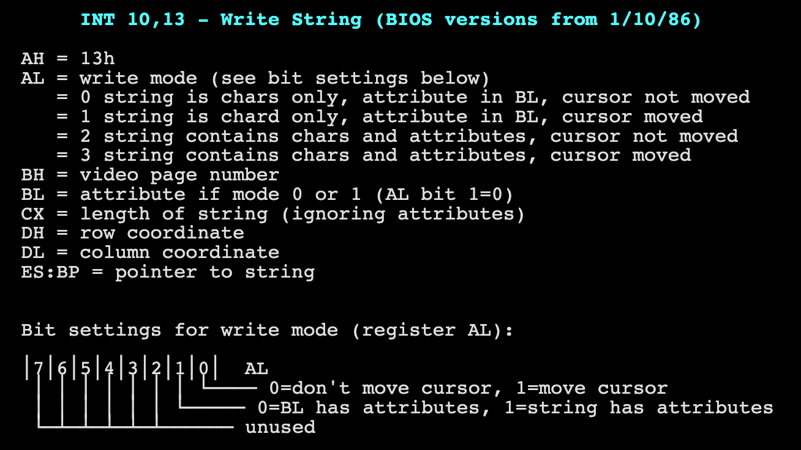

[toc]

本章主要讨论如何输出字符串到屏幕。

平常我们写应用层app显示字符串时直接调用glibc中的printf，而这个printf会system call到底层OS的对应kprintf，最终显示在系统上面。

可是我们这里不能使用printf，而只能自己实现打印功能，类似于kprintf。

为啥？ 
因为你既没有GLIBC，有没有OS。 就问问你，你想依靠谁？ 
答案只有一个，自己！！！

撸起袖子，干就完了！

方法很多，但是我们主要是集中在如何实现上，方式上，所以不一定会照顾到效率或者可重入之类的性能和安全指标。请各位看官勿喷！ 远离喷子！

故本章内容主要包括：

    1. 了解显示历史
    2. 显示标准 - MDA，CGA，VGA ...
    3. 显示器连接总线 ISA，AGP...
    4. 显示方式
    5. 显示模式 - 字符模式和图形模式

本章内容比较偏向于硬件，所以有所疑问，可以网上搜索！
同时，我也会定期更新本章内容，满足大家要求！
另外，如果在网上很容易就可以获得的基本知识，我这里有可能就不重复了。
望理解！ 万岁！！

# 字符模式
#### 概念
 我们只要把字符的ASCII写到显存中，然后显卡芯片会利用字符发生器电路直接把对应的字符显示在屏幕上。
 标准模式： 25x80

#### 字符表示
- 字符如何组织？ 简单！ 就是用两个字节表示一个字符。 例如0x0241 高字节02是字符属性， 低字节41是字符ascii码。
- 字符属性字节格式： 0xlbbbifff   
    * l位 代表blink
    * bbb位 代表background color
    * i位 代表highlight位 （1 - 颜色变浅）
    * fff位 代表foreground color也就是字符颜色

- bbb 或者 fff 颜色表

    |ifff|color|ifff|color|
    |---|---|---|---|
    |0000|黑色|1000|深灰|
    |0001|蓝色|1001|淡蓝|
    |0010|绿色|1010|淡绿|
    |0011|青涩|1011|淡青|
    |0100|红色|1100|淡红|
    |0101|品红|1101|淡品红|
    |0110|棕色|1110|黄色|
    |0111|灰白|1111|白色|

#### 显存位置
|显示标准|Memory Location|Memory Size|Comments|
|---|---|---|---|
|MDA|0xb0000 - 0xb2000 |2 Pages|Monochrome Display Adapter|
|CGA|0xb8000 - 0xbc000|4 Pages|Color Graphics Adapter|
|VGA|||Video Graphics Adapter|

# 图形模式

#### 显存位置
|显示标准|Memory Location|Memory Size|Comments|
|---|---|---|---|
|MDA|||Monochrome Display Adapter|
|CGA|||Color Graphics Adapter|
|VGA|0xa0000 - 0xa8000|8 Pages|Video Graphics Adapter|

# 字符模式方法一： BIOS routine

