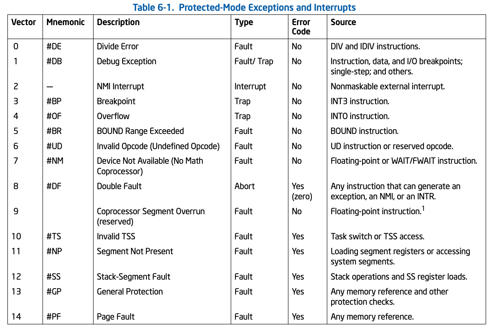

[toc]

本章主要就是实操 Exception && INTERRUPT！！！

非常重要的概念！ 在操作系统内部或者上层应用开发中，都他妈的很重要！

注意了，精神点！

主要内容包括:

    1. 什么是Exception？
    2. Exception分类: Fault & Trap & Abort
    3. 中断源: 软中断 CPU内部中断 外部中断(可屏蔽 不可屏蔽)
    4. IF标志
    5. Interrupt Gate and Trap Gate
    6. IVT IDT
    7. 中断处理过程
    8. PIC控制器
    9. RTC
    10.Timer 8042

# 异常

# 中断 IVT

# 中断 IDT

# IF

# Interrupt Gate vs. Trap Gate

# 中断处理过程

# PIC

# RTC
参考basic.s查看如何使用RTC.

CMOS 内存信息:
|OFFSET|Content|
|---|---|
|0x00|Second|
|0x01|Alarm Second|
|0x02|Minute|
|0x03|Alarm Minute|
|0x04|Hour|
|0x05|Alarm Hour|
|0x06|Week|
|0x07|Day|
|0x08|Month|
|0x09|Year|
|0x0A|Register A; R/W|
|0x0B|Register B; R/W|
|0x0C|Register C; R|
|0x0D|Register D; R/W|

端口:
|Port|Desc|
|---|---|
|0x70|Index port|
|0x71|Data port|
- Index port的最高位控制NMI中断的开关；当MASK用。
- Bit7 = 1; Disable NMI
- Bit7 = 0; Enable NMI

Register B:
|Bit7|Bit6|Bit5|Bit4|Bit3|Bit2|Bit1|Bit0|
|---|---|---|---|---|---|---|---|
|Update Cycle Inhibit|Periodic Interrupt Enalbe|Alarm Interrupt Enable|Update Interrupt Enable|0|0: BCD 1: Binary|0: 12Hours 1: 24Hours|0|

Register C:
|Bit7|Bit6|Bit5|Bit4|Bit3-0|
|---|---|---|---|---|
|Interrupt Flag|Periodic Interrupt|Alarm Interrupt|Update Interrupt|0|
- **每次中断后一定要读RegisterC, 这样才会出发下次中断。**

