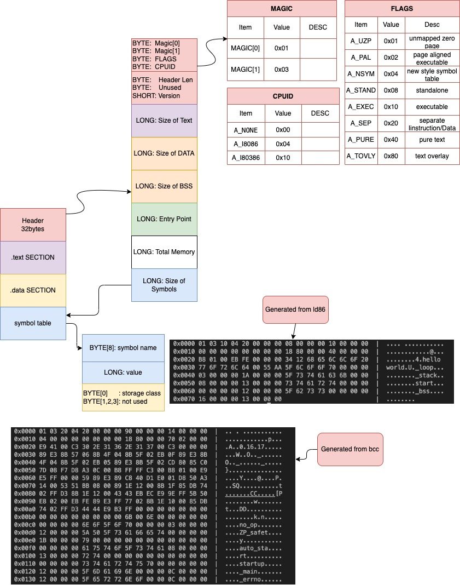
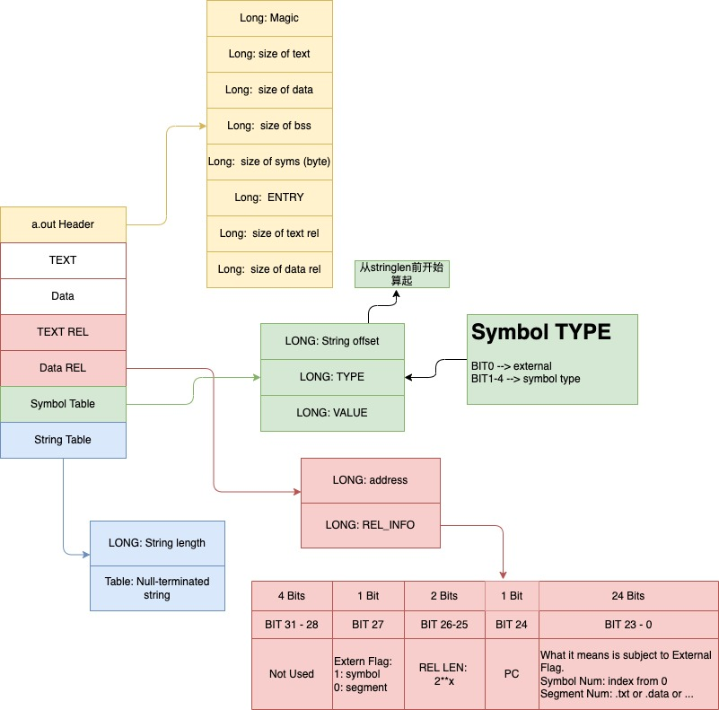
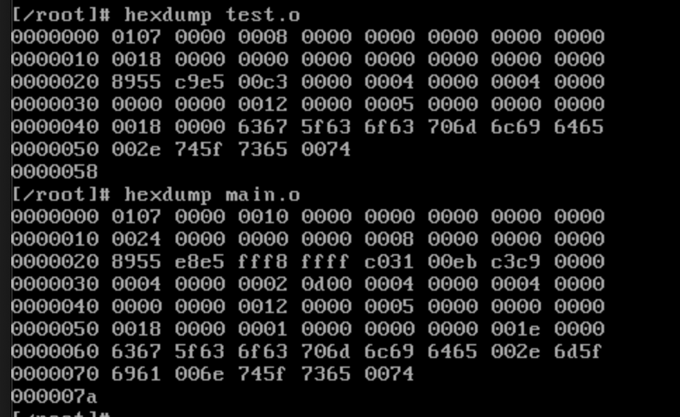
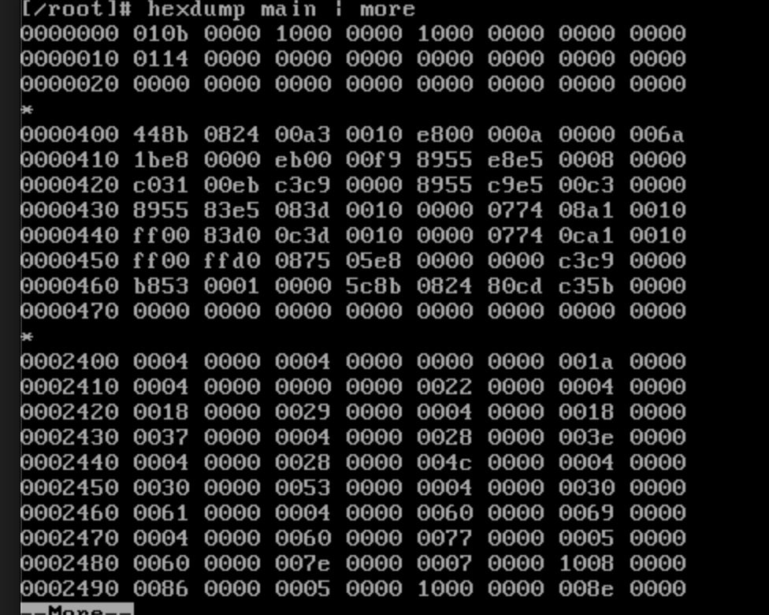

[toc]

突然想起来，a.out格式还是要稍微说下，毕竟在linux0.12中目标文件用的就是这种格式。 在进程加载那个章节还是会用到的。

学会了a.out，以后对ELF格式的学习也会有所帮助。

请注意，这里我们要讨论几个不同的格式：
1. `a.out` from GCC 1.40 used by Linux 0.12
2. `a.out` generated by bcc(dev86) or ld86(dev86)
4. `object format` from bcc(dev86) or as86(dev86)

本章主要知识点如下：

    1. a.out 头结构
    2. a.out 内存布局
    3. 重定位
    4. symbol
    5. string


---------------------------
# a.out - (bcc or ld86)

#### HEADER
```
struct  exec {                /* a.out header */
    unsigned char a_magic[2]; /* magic number */
    unsigned char a_flags;    /* flags, see below */
    unsigned char a_cpu;      /* cpu id */
    unsigned char a_hdrlen;   /* length of header */
    unsigned char a_unused;   /* reserved for future use */
    unsigned short a_version; /* version stamp (not used at present) */
    long      a_text;     /* size of text segement in bytes */
    long      a_data;     /* size of data segment in bytes */
    long      a_bss;      /* size of bss segment in bytes */
    long      a_entry;    /* entry point */
    long      a_total;    /* total memory allocated */
    long      a_syms;     /* size of symbol table */

    /* SHORT FORM ENDS HERE */ 
    long      a_trsize;   /* text relocation size */ 
    long      a_drsize;   /* data relocation size */ 
    long      a_tbase;    /* text relocation base */ 
    long      a_dbase;    /* data relocation base */ 
};
```

#### MAGIC NUMBER

    #define A_MAGIC0      (unsigned char) 0x01
    #define A_MAGIC1      (unsigned char) 0x03

##### FLAGS
    #define A_UZP   0x01    /* unmapped zero page (pages) */
    #define A_PAL   0x02    /* page aligned executable */
    #define A_NSYM  0x04    /* new style symbol table */
    #define A_STAND 0x08    /* standalone executable */
    #define A_EXEC  0x10    /* executable */
    #define A_SEP   0x20    /* separate I/D */
    #define A_PURE  0x40    /* pure text */
    #define A_TOVLY 0x80    /* text overlay */

#### CPU ID
    #define A_NONE  0x00    /* unknown */
    #define A_I8086 0x04    /* intel i8086/8088 */
    #define A_I80386 0x10   /* intel i80386 */


#### Symbol
```
struct nlist {          /* symbol table entry */
    char n_name[8];       /* symbol name */
    long n_value;         /* value */
    unsigned char n_sclass;   /* storage class */
    unsigned char n_numaux;   /* number of auxiliary entries (not used) */
    unsigned short n_type;    /* language base and derived type (not used) */
};
```

    /* Low 3 bits of storage class (section). */
    #define N_SECT        07    /* section mask */
    #define N_UNDF        00    /* undefined */
    #define N_ABS         01    /* absolute */
    #define N_TEXT        02    /* text */
    #define N_DATA        03    /* data */
    #define N_BSS         04    /* bss */
    #define N_COMM        05    /* (common) */

    /* High 5 bits of storage class. (八进制)*/
    #define N_CLASS     0370    /* storage class mask */
    #define C_NULL
    #define C_EXT       0020    /* external symbol */
    #define C_STAT      0030    /* static */


#### Diagram



---------------------------
# a.out - (gcc 1.40 in linux0.12)

#### Header
```
struct exec { /* 文件头结构 */
    unsigned long a_magic;	/* Use macros N_MAGIC, etc for access */  /* 执行文件魔数。使用N_MAGIC等宏访问 */
    unsigned a_text;		/* length of text, in bytes */  /* 代码长度，字节数 */
    unsigned a_data;		/* length of data, in bytes */  /* 数据长度，字节数 */
    unsigned a_bss;		/* length of uninitialized data area for file, in bytes */ /* 文件中的未初始化数据区的长度，字节数 */
    unsigned a_syms;		/* length of symbol table data in file, in bytes */ /* 文件中的符号表长度，字节数 */
    unsigned a_entry;		/* start address */ /* 执行开始地址 */
    unsigned a_trsize;		/* length of relocation info for text, in bytes */ /* 代码重定位信息长度，字节数 */
    unsigned a_drsize;		/* length of relocation info for data, in bytes */ /* 数据重定位信息长度，字节数 */
};
```

Magic Number:
|Magic|Number|DESC|
|---|---|---|
|OMAGIC|0407(0x107)|Object File or Impure Excecutable|
|NMAGIC|0410(0x108)|Pure Executable|
|ZMAGIC|0413(0x10b)|demand-paged Executable: .text starts from 1KB(0x400); The text and data sizes are both multiples of the page size.|


#### Symbol
```
struct nlist {
    union {
        char *n_name;
        struct nlist *n_next;
        long n_strx;
    } n_un;
    unsigned char n_type;
    char n_other;
    short n_desc;
    unsigned long n_value;
};
```

|TYPE|VALUE|DESC|
|---|---|---|
|N_UNDF|0x00||
|N_ABS|0x02||
|N_TEXT|0x04||
|N_DATA|0x06||
|N_BSS|0x08||
|N_COMM|0x12||
|N_EXT|0x01||


#### Relocation
```
struct relocation_info  /* 重定向信息部分 */
{
    int r_address;  // 段内需要重定位的地址。

    unsigned int r_symbolnum:24;  // 含义与r_extern有关。指定符号表中一个符号或者一个段。
    unsigned int r_pcrel:1; // 1位。PC相关标志。即它作为一个相对地址被用于指令当中
    unsigned int r_length:2;  // 2位。指定要被重定位字段长度（2的次方），0到3分别表示被重定位项的宽度是1B、2B、4B或8B
    unsigned int r_extern:1;  // 外部标志位。1 - 以符号的值重定位。0 - 以段的地址重定位。
    unsigned int r_pad:4; // 没有使用的4个位，但最好将它们复位掉。
};
```

#### Diagram



#### Sample of a.out for Linux0.12
main.c

```
void test();
int main(int argc, char* argv)
{
    test();
}
```
test.c
```
void test()
{
}
```
test.o & main.o


main



---------------------------
# Object format - (as86 or bcc)


